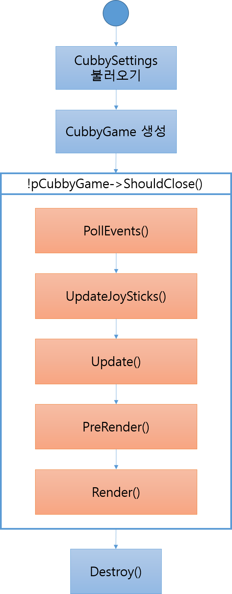

# MineScroll-Cubby 분석일지

## 들어가기 전

### 이 문서는

Cubby 라고 하는 오픈 소스 Voxel 엔진의 소스코드를 연구한 것을 정리한 문서이다.

잘 모르는 부분은 <u>밑줄</u>으로 표시한다.

## 작동 흐름

## Cubby 사용 클래스 목록

본 항목에서는 Cubby에서 사용하는 모든 클래스를 설명하지 않는다. 

| 클래스명              | 설명                                       |
| ----------------- | ---------------------------------------- |
| CubbyGame         | **게임 자체를 표현**하는 싱글턴 형식의 클래스.             |
| CubbySettings     | 게임의 **설정 또는 옵션 사항**을 불러오거나, 저장하는 클래스.    |
| CubbyWindow       | 게임의 **윈도우의 이벤트**(생성, Resize, 키보드 또는 마우스 입력 이벤트 등)를 관리하는 클래스. |
| Renderer          | 게임의 **렌더링에 대한 처리**를 담당하는 클래스.            |
| OpenGLGUI         | 모든 GUI와 관련된 처리를 담당하는 클래스.                |
| Camera            | 카메라의 벡터, 또는 그들의 변환(이동, 회전 등)을 담당하는 클래스.  |
| ModesManager      | 게임에 적용되는 그래픽, 사운드 등의 모드를 가져오는 데 사용하는 클래스. |
| SoundManager      | 게임에 사용되는 음악들의 재생 또는 정지를 담당하는 클래스.        |
| ChunkManager      | 게임에서 동작하는 주요 오브젝트(플레이어, 적, NPC, 아이템 등)   |
| Quest             | 게임 내에서 주어지는 퀘스트에 대한 클래스.                 |
| QuestManager      | Quest 객체를 다루는 클래스.                       |
| RandomLootManager | 캐릭터의 전리품을 관리하는 클래스.                      |
| ProjectileManager | 투사체를 관리하는 클래스.                           |
| FrontendManager   | 프론트 엔드 또는 GUI의 기본 기능(ex: 버튼 클릭 효과)들을 관리하는 클래스. |

## 프로그램 플로우

### 1. CubbySettings에서 설정 사항 불러오기

게임을 시작하기 전에는 먼저 해당 게임의 설정 사항을 불러오는 작업을 한다. 이러한 설정 사항은 **Settings** 와 **Options** 로 나뉘는데, 각각의 대표적인 설정 사항은 다음과 같다.

1. Settings
   - Graphics
     - 창의 너비 or 높이
     - 수직동기화
     - 그림자 활성화
     - 블러 효과
     - SSAO etc....
   - <u>Landscape generation</u>
   - Debug
     - <u>LoaderRadius</u>
     - 디버그 렌더링
     - <u>스텝 업데이트</u>
     - 와이어 프레임 렌더링
     - 디버그용 GUI
2. Options
   - Gameplay
     - 마우스 이동 방향 거꾸로 하기
     - 마우스/게임 패드 감도
   - Graphics
     - 그림자
     - 안개 렌더링
     - 물 렌더링
   - Sound
     - 게임 내 소리 활성화 / 볼륨
     - 게임 음악 활성화 / 볼륨
   - Interface
     - 조준점 렌더링
     - HUD 애니메이션
     - 커스텀 커서

### 2. CubbyGame 인스턴스 활성화하기

다음으로 해야 할 작업은 CubbyGame의 인스턴스를 활성화시켜야 한다.

일단 해당 클래스는 싱글턴 디자인으로 구현되어있기 때문에 `CubbyGame::GetInstance()` 라는 메소드를 사용하여 인스턴스를 생성한다.

그 다음은 해당 클래스의 메소드 Create()를 호출하여 게임의 초기 설정을 구성한다.

Create에서는 게임의 초기 설정을 담당하는 멤버 객체를 초기화하는데, 위에서 설명한 클래스들의 객체(그 이외 다수 포함)들이 이에 해당한다.

### 3. CubbyGame 루프

CubbyGame의 인스턴스 활성화가 완료되면, 본격적으로 프로그램의 루프 동작으로 넘어간다. 이 루프 동작에서는 다음의 작업을 수행한다.

#### A. PollEvents

PollEvents에서는 이벤트 큐에 메시지가 있는지 검사하고 있으면 해당 메시지에 해당하는 콜백 함수를 실행한다.

#### B. UpdateJoySticks

게임패드와 같은 조이스틱 형식의 입력 장치가 있을 경우 해당 함수는 유효하다. 조이스틱의 입력 사항을 저장한다.

#### C. Update

CubbyGame에서 초기화되었던 객체들을 업데이트한다.

#### D. PreRender

뒤의 Render 작업을 하기 전에 렌더 대상들의 행렬들을 업데이트한다.

#### E. Render

렌더링할(화면 안에 들어오는) 대상들을 렌더링한다.